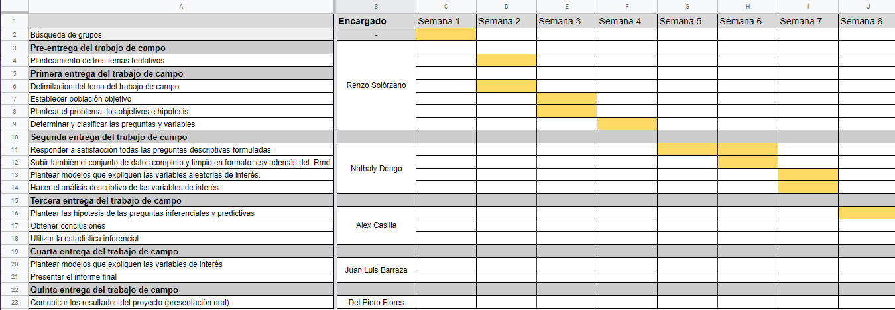
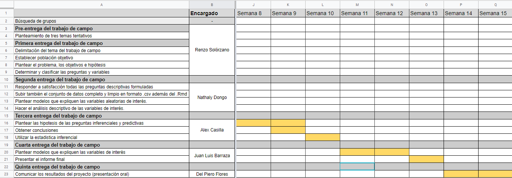

<center> {width=50%} </center>

#Segunda Entrega

##Integrantes:

* Renzo Solórzano
* Juan Luis Barraza
* **Nathaly Dongo (Líder)**
* Del Piero Flores
* Alex Casilla

###Profesor:

####Gálvez Perez, Humberto Emiliano 

###Sección:

####5

---

##Problemática:

<p style="text-align: justify;">Según la Organización Mundial de la Salud la tuberculosis es una de las principales causas de mortalidad en el mundo, y su incidencia en el Perú decrece con lentitud. Por lo que sabemos, son varias las medidas que se han tomado entorno a esta problemática, desde la implementación de la Ley 30287, "Ley para la Prevención y Control de la Tuberculosis en el Perú". Por ejemplo, en cuanto a la inversión de salud, para el año 2010 el estado asignó una cifra equivalente a 2’107,167.15 nuevos soles para Proyectos de Inversión Pública (PIP) en este sector. Sin embargo, sólo poco más del 42% fue ejecutado para dicho motivo presentando un nivel bajo de ejecución presupuestal (Monje, 2011). Esto sugiere que, en el sector de salud, las inversiones, realizadas por el estado, carecen de planificación debido a que en los puntos más preocupantes no llega el apoyo correspondiente. En ese sentido **la problemática converge en la inefectividad de la gestión presupuestaria por parte del estado para la inversión de prevención y tratamiento del TBC.**</p> 


<p style="text-align: justify;">La inefectividad de su ejecución presupuestal nos hace preguntarnos ¿cuál es la lógica del presupuesto para la TBC en el Perú?, ¿a qué se deben estos bajos niveles de inversión efectiva?, y más importante aún ¿Cuál es la magnitud de las consecuencias que acarrea dicha inefectividad? Esta investigación pretende entender y responder a la problemática a través de un análisis estadístico de la gestión presupuestaria para la inversión de prevención y tratamiento del TBC por parte del estado en las distintas regiones y departamentos entre los años del 2012 y el 2018.</p> 

###Objetivos:

* ####Objetivo General:
    Estudiar la correlación entre el presupuesto invertido para el control y la prevención de la tuberculosis y la situación epidemiológica de la TBC en el Perú entre el 2012 y 2018
* ####Objetivos Específicos:

    + Comprobar la relación entre presupuesto invertido por el Ministerio de Salud y los casos de TBC en el Perú  
    + Identificar la sala situacional de TBC (proporciones y tendencias) en los distintos departamentos y regiones del Perú 
    + Comprobar si el presupuesto invertido por el Ministerio de Salud es el suficiente para abarcar la mayoría de los casos de TBC en el Perú
  
    *-**Sala situacional:** Descripción de la situación mediante la tasa de incidencia, mortalidad, morbilidad, etc.*

###Antecendentes:
<p style="text-align: justify;">Actualmente no existe ningún estudio sobre la tuberculosis y el prespuesto invertido para su prevención y control en el Perú, por lo que nuestro estudio sería el primero en este aspecto.</p>

<p style="text-align: justify;">Por un lado, hemos encontrado algunas referencias que nos ayudarán a plantear nuestro problema para lograr nuestros objetivos. El primero de ellos es un libro titulado "La Efectividad de la inversión pública a nivel regional y local durante el periodo 2009 al 2014", este documento trata de manera descriptiva (sin usar algún estudio estadístico) los indicadores de inversión pública y su impacto en las principales áreas públicas: educación, saneamiento, transporte y salud.</p>

<p style="text-align: justify;"> Por otro lado, la fuente más cercana a nuestro estudio es un artículo llamado "Equidad e inversión en salud pública de la República del Perú", en este artículo se comparan resultados específicos como la tasa de mortalidad y el presupuesto invertido en un determinado año, respondiendo de esta manera a preguntas (mayormente descriptivas). La ventaja de tener a esta fuente como antecente nos facilitarpa la  elaboración de hipotesis sobre comportamientos que observemos a lo largo del estudio.</p>

###Población Objetivo:
La población objetivo se encuentra conformada por aquellas personas que presentan casos de TBC en el Perú.

###Muestra y recopilación de datos:
<p style="text-align: justify;">- La mayoría de datos serán recopilados directamente del Portal de la DPCTB - Dirección de Prevención y Control de Tuberculosis, bajo la direccion del MINSA. El enlace a dicha base de datos es el siguiente: <a href=”http://www.tuberculosis.minsa.gob.pe/DashboardDPCTB/PerfilTB.aspx”>anchor text</a>. Así mismo, las variables a la que corresponden estos datos serían las tasas de mortalidad, las tasas de inicidencia,  morbilidad, la tasa de éxito y el número de casos de TBC y de casos nuevos. Por último, las referencias de esta fuente se encuentran en la bibliografía del presente documento.</p>

<p style="text-align: justify;">- Nuestra segunda fuente de datos está conformada por el Ministerio de Economía y Finanzas, específicamente por la sección de Presupuesto para el sector Público y los Proyectos de Presupuestos Anuales (Anexo 8). En enlace para esta fuente es <a href=”https://www.mef.gob.pe/es/presupuesto-del-sector-publico/proyecto-de-presupuesto”>anchor text</a> y como la fuente anterior, su correcta cita bibliográfica se encuentra en la parte inferior del documento.</p>

<p style="text-align: justify;">- Por último, nuestra tercera fuente de datos la conforma el Instituto de Estadística e Informática., específicamente la sección de Condiciones Físicas. El link correspondiente a este punto es  <a href=”https://www.inei.gob.pe/estadisticas/indice-tematico/a1-condiciones-fisicas-10234/>anchor text</a> y la cita correspondiente está en la bibliografía del documento.</p>

##Preguntas planteadas
  
N°|  Preguntas                                                                                                                          |   Tipo
--|-------------------------------------------------------------------------------------------------------------------------------------|-------------
1 | En qué años se dieron mayores casos nuevos de tuberculosis a nivel nacional                                                                               | Descriptiva
2 | ¿Qué departamento tuvo el presupuesto más bajo y cuál el más alto para el control y la prevención de TBC entre el 2012 y el 2018?   | Descriptiva
3 | ¿Cuál es el incremento de la tasa de mortalidad, debido a la TBC, entre el 2012 y 2018?                                             | Descriptiva
4 | ¿Cuáles son las zonas donde se es más propenso a contraer TBC?                                                                      | Descriptiva
5 | ¿Qué años tuvieron las tres tasas de mortalidad e incidencia por TBC más bajas a nivel nacional?                                    | Descriptiva
6 | ¿Existe una tendencia entre el presupuesto invertido y la tasa de mortalidad por TBC?                                               | Exploratoria
7 | ¿Los departamentos con menor presupuesto presentan una mayor o una menor cantidad de casos de TBC?                                  | Exploratoria
8 | ¿Cómo se relaciona el presupuesto invertido para la prevención con el número de casos nuevos de TBC?                                | Exploratoria
9 | ¿La presencia de CO2 guarda alguna relación con la aparición de nuevos casos de TBC?                                                | Inferencial
10| ¿El aumento de presupuesto se comporta de manera eficaz para la prevención y tratamiento del TBC?                                   | Inferencial
11| ¿Es posible predecir si las personas mejorarán su estado con TBC en base al aumento del presupuesto?                                | Predictiva
12| ¿Es posible predecir la región a partir de la tasa de mortalidad o morbilidad por TBC?                                              | Predictiva
13| ¿Qué factores influyen en la distribución del presupuesto para la prevención en las regiones?                                       | Causal
14| ¿Qué factores afectan la tasa de mortalidad de TBC?                                                                                 | Causal
15|¿De qué manera ciertas condiciones determinan la variación de mortalidad e incidencia de TBC?                                        | Mecanística
16| ¿Cómo ciertas condiciones indican la distribución de presupuesto para el TBC?                                                       | Mecanística


##Variables a estudiar

N° |  Variables  |  Relación con preguntas  |  Tipo    |   Subtipo de variables
-- | ----------- | ------------------------ | -------- | -------------------------
1 | Año | 1,5 | Cuantitativa | Discreta
2 | Departamentos | 2,7 | Cualitativa | Nominal
3 | Tasa de Mortalidad | 3,14,15 | Cuantitativa | Continua
4 | Región | 12,13 | Cualitativa | Nominal
5 | Tasa de incidencia | 5 | Cuantitativa | Continua
6 | Presupuesto invertido | 6,7,8,10,11,13,16 |  Cuantitativa | Discreta
7 | Número de casos de TBC | 1 | Cuantitativa | Discreta
8 | Número de casos nuevos | 8 | Cuantitativa | Discreta
9 | Presencia de CO2(miles de ton) | 9 | Cuantitativa | Continua
10 | Tasa de morbilidad | 12 |  Cuantitativa | Continua
11 | Tasa de éxito | 10 |  Cuantitativa | Continua

##Diagrama de Gantt

Suponiendo que hay una intervalo de 3 semanas para cada entrega planificamos el siguiente Diagrama de Gantt.

<center>  </center>

<center>  </center>

##Preguntas 
```{r, echo=FALSE, error=FALSE, results='hide'}
datos <- read.csv(file = "Datos.csv", fileEncoding = "UTF-8")
```

###Preguntas descriptivas

**- ¿En qué años se dieron mayores casos nuevos de tuberculosis a nivel nacional?**
<p style="text-align: justify;">Para responder esta pregunta se realizó un grafico de barras de los años vs el N° de casos de TBC desde el 2012 hasta el 2018, aquí podemos identificar en que años se dieron mayores casos nuevos de tuberculosis a nivel nacional.</p> 

```{r, echo=TRUE}
x<-0
morbilidad_porr_anho<-c()
anhos<-c()
for (i in 2012:2018){
       x<-x+1
       morbilidad_porr_anho[x]<-sum(datos$Numero.de.casos.Nuevos[datos$Año==i])
       anhos[x]<-i
}
casos <- morbilidad_porr_anho/1000
names(casos)<-anhos
barplot(casos,main="Gráfico N°1: Número de casos de TBC desde el 2012 hasta el 2018 en el Perú"
        ,ylab ="N* de casos de TBC (miles de personas)"
        ,xlab ="Años"
        ,ylim=c(0,25)
        ,cex.main=1.25
        ,cex.lab=0.8
        ,col = "#6666FF"
        ,cex.main=1
        ,cex.names = 0.8)
```

<p style="text-align: justify;">Según el Gráfico N°1: Número de casos de TBC desde el 2012 hasta el 2018 en el Perú, es posible afirmar que el año **`r format (names(casos[which.max(morbilidad_porr_anho)])) `** fue el año en el que aparecieron un mayor número de casos nuevos de TBC a nivel nacional, aproximadamente **`r format  (casos[which.max(morbilidad_porr_anho)]) `** miles de personas. Esta cifra continuó disminuyendo en los siguiente años, sobretodo en el año **`r format  (names(casos[which.min(morbilidad_porr_anho)])) `**. Sin embargo, es importante observar que el número de casos nuevos de TBC tuvo un ligero incremento entre el **`r format (names(casos[which.min(morbilidad_porr_anho)])) `** y el **2018**.</p> 

**- Qué departamento tuvo el presupuesto más bajo y cuál el más alto para el control y la prevención de TBC entre el 2012 y el 2018?**

Para determinar el presupuesto mas bajo y alto en el periodo a analizar se utilizarán la media con respecto a la distribución en los años 2012 a 2018 

```{r}
departamentos1<-unique(datos$Departamento)
Departamentos<-datos$Departamento
Morbilidad<-datos$Morbilidad
Presupuesto.orientado<-datos$Presupuesto.para.el.programa.orientado.a.disminuir.la.incidencia.de.TBC.y.VIH
datos4<-data.frame(Departamentos,Morbilidad,Presupuesto.orientado)

Morbilidad2<-c()
Presupuesto.orientado2<-c()
for (i in 1:25){
aux<-sum(datos4$Morbilidad[which(datos4$Departamentos==Departamentos[c(i)])])/7
Morbilidad2<-c(Morbilidad2,aux)
aux2<-sum(datos4$Presupuesto.orientado[which(datos4$Departamentos==Departamentos[c(i)])])/7
Presupuesto.orientado2<-c(Presupuesto.orientado2,aux2)
}

P<-Presupuesto.orientado2/1000000

Departamentos2<-Departamentos[c(1,2,3,4,5,6,7,8,9,10,11,12,13,14,15,16,17,18,19,20,21,22,23,24,25)]
datos5<-data.frame(Departamentos2,Morbilidad2,Presupuesto.orientado2)
barplot(P,main="Gráfico N°2: Presupuesto invertido por Departamento"
        ,ylab = "Presupuesto en millones de soles"
        ,width = 0.85
        ,col = "skyblue"
        ,ylim =c(0,20)
        ,cex.main=1
        ,cex.lab=0.8)
axis(1,at=1:25,labels = departamentos1,las=3,cex.axis=0.7)

```

<p style="text-align: justify;">En el Gráfico N°2 podemos observar la media de como se han distribuido los presupuestos en el periodo  de 2012 y 2018; de lo cual podemos encontrar que la media de menor presupuesto es de **`r format (min(datos5$Presupuesto.orientado2))`** soles y corresponde al departamento de **`r format (datos5$Departamentos2[which(datos5$Presupuesto.orientado2==min(Presupuesto.orientado2))])`** soles, luego tenemos el departamento de mayor presupuesto invertido que es el de  **`r format (datos5$Departamentos2[which(datos5$Presupuesto.orientado2==max(Presupuesto.orientado2))])`** con una media de  **`r format (max(datos5$Presupuesto.orientado2))`** soles. </p> 


**- ¿Cuál es el incremento de la tasa de mortalidad, debido a la TBC, entre el 2012 y 2018? **
```{r}
tasa12 <- datos$Tasa.de.mortalidad[which(datos$Año==2012)]
tasa13 <- datos$Tasa.de.mortalidad[which(datos$Año==2013)]
tasa14 <- datos$Tasa.de.mortalidad[which(datos$Año==2014)]
tasa15 <- datos$Tasa.de.mortalidad[which(datos$Año==2015)]
tasa16 <- datos$Tasa.de.mortalidad[which(datos$Año==2016)]
tasa17 <- datos$Tasa.de.mortalidad[which(datos$Año==2017)]
tasa18 <- datos$Tasa.de.mortalidad[which(datos$Año==2018)]
Vs=(seq(from=mean(tasa12),to=mean(tasa18),by=(mean(tasa18)-mean(tasa12))/6))
length(Vs)
length(2012:2018) 
tasasprom <- c(mean(tasa12),mean(tasa13),mean(tasa14),mean(tasa15),mean(tasa16),mean(tasa17),mean(tasa18))
length(tasasprom)
plot(y=tasasprom,x = 2012:2018
     ,main = "Gráfico N°3: Media de las tasas de mortalidad en el Perú entre 2012-2018"
     ,xlab = "Año"
     ,ylab = "Tasa promedio"
     ,ylim = c(2,4)
     ,type ="o"
     ,pch = 19
     ,cex.main=1
     ,col = c("blue4"));
lines(y=Vs,x = 2012:2018, col="red2",lwd=2)
legend(2012,4,legend=c("Tasa promedio","Aumento porcentual en 6 años"),col=c("blue4","red2"),lwd=2)

```

<p style="text-align: justify;">En el Gráfico N°3 se puede observar la tasa promedio de mortalidad por TBC en el Perú. En 2012 comenzó con una tasa promedio de **`r format (mean(tasa12))`**, al año siguiente la tasa bajo hasta **`r format (mean(tasa13))`** la cual es la tasa más baja en nuestro estudio. En el 2014 se presentó la tasa más alta de mortalidad, la cual fue **`r format (mean(tasa14))`**. En los años siguiente se mantuvo una tasa constante de **`r format (mean(c(mean(tasa15), mean(tasa16), mean(tasa17), mean(tasa18))))`**.</p> 

<p style="text-align: justify;">Encontramos la variación porcentual entre el 2012 y 2018 `(mean(tasa18)-mean(tasa12))/mean(tasa12)*100` y lo dividimos entre 6 y obtenemos **`r format (round((mean(tasa18)-mean(tasa12))/mean(tasa12)*100/6,2))`%**; aproximadamente la tasa de mortalidad promedio en Perú **ha aumentado 1%** por año.</p> 

**- ¿Cuáles son los departamentos donde se es más propenso a contraer TBC?**
<p style="text-align: justify;">Teniendo los datos de los número de casos nuevos por departamentos desde 2012 hasta 2018 dentro de nuestros datos originales, procedemos a elaborar una tabla secundaria con los datos a emplear en esta pregunta. Se debe resaltar que en dicha tabla se observa los datos promedios, durante el intervalo de tiempo mencionado,por departamentos</p>


```{r}
Departamentos <-datos[,"Departamento"]
Numero.de.casos.nuevos<-datos[,"Numero.de.casos.Nuevos"]

datos2<-data.frame(Departamentos,Numero.de.casos.nuevos)
Numero.de.casos.nuevos2<-c()
for (i in 1:25)
{
aux<-sum(datos2$Numero.de.casos.nuevos[which(datos2$Departamentos==Departamentos[c(i)])])/7
Numero.de.casos.nuevos2<-c(Numero.de.casos.nuevos2,aux)
}
Departamentos2<-Departamentos[c(1,2,3,4,5,6,7,8,9,10,11,12,13,14,15,16,17,18,19,20,21,22,23,24,25)]
datos3<-data.frame(Departamentos2,Numero.de.casos.nuevos2)

dep<-c("Amazonas","Áncash","Apurímac","Arequipa","Ayacucho","Cajamarca","Callao","Cusco","Huancavelica","Huánuco","Ica","Junín","La Libertad","Lambayeque","Lima","Loreto","Madre de Dios","Moquegua","Pasco","Piura","Puno","San Martín","Tacna","Tumbes","Ucayali")

barplot(datos3$Numero.de.casos.nuevos2,main = "Nº de casos nuevos de TBC por departamento",width=0.85 ,ylab =  "Número de casos nuevos de TBC", col=rainbow(25))
axis(1,at=1:25,labels = dep,las=3,cex.axis=0.7)
```

<p style="text-align: justify;">El gráfico de barras muestra como el departamento con mayor número de casos nuevos por año es Lima con un **`r format (max(Numero.de.casos.nuevos2))`**, mientras que 
Pasco presenta el menor número de caso nuevos **`r format (min(Numero.de.casos.nuevos2))`**.Como se aprecia existe una gran diferencia entre la cifra de Lima y los demas departamentos. Por ejemplo, el segundo departamento con mayor número de caso, Loreto, difere del primero en un aproximado de 6691. Ante todo lo mencionado se señala que las personas de la zona de Lima son mas propensas a contraer TBC en el Perú.</p>

**- ¿Qué años tuvieron las tres tasas de mortalidad e incidencia por TBC más bajas a nivel nacional?**

```{r}
z<-0
mortalidad<-c()
años<-c()
for(i in 2012:2018){
  z<-z+1
  mortalidad[z]<- sum(datos$Tasa.de.mortalidad[datos$Año==i])
  años[z]<-i
}
cases<-mortalidad/1000
names(cases)<-años
barplot(casos,main="Gráfico N°4: Tasa de mortalidad desde el 2012 hasta el 2018 en el Perú"
        ,ylab ="Tasa de mortalidad"
        ,xlab ="Años"
        ,ylim=c(0,30)
        ,cex.main=1
        ,cex.lab=0.8
        ,col = "#1234F8")
```
<p style="text-align: justify;">Como podemos observar a partir de los datos representados en el Gráfico N°4 de barras, la tasa de mortalidad disminuyó de manera constante durante los primeros 6 años; mientras que para el 2018 esta disminuyó con una pendiente más pronunciada; es decir, la tasa de mortalidad disminuyó de una manera más eficiente. Esto se puede dar debido a diversos factores que se analizarán más adelante, como por ejemplo, el presupuesto invertido por diversas institituciones.</p> 

```{r}
x<-0
morbilidad_porr_anho<-c()
anhos<-c()
for (i in 2012:2018){
       x<-x+1
       morbilidad_porr_anho[x]<-sum(datos$Morbilidad[datos$Año==i])
       anhos[x]<-i
}
casos <- morbilidad_porr_anho/1000
names(casos)<-anhos

barplot(casos
        ,main="Gráfico N°5: N° de casos de TBC desde el 2012 hasta el 2018 en el Perú"
        ,ylab ="N* de casos de TBC (miles de personas)"
        ,xlab ="Años"
        ,ylim=c(0,30)
        ,cex.main=1
        ,cex.lab=0.8
        ,col = "#6666FF")
```

<p style="text-align: justify;">De un análisis similar al de la tasa de mortalidad, podemos observar en el Gráfico N°5, que el número de casos nuevos de TBC se comporta de una manera similar; es decir, que durante los primeros seis años, tiene un comportamiento de decrecimiento constante. Mientras que para el 2018, esta disminuyó de una manera bastante pronunciada. Al igual que en el caso anterior, podemos ver que debe haber un caso externo en ese periodo de tiempo, como una inversión mayor en el presupuesto otorgado a los casos de tuberculosis, o una intervención guvernamental que se analizará más adelante.</p> 


###Preguntas exploratorias

**- ¿Existe una tendencia entre el presupuesto invertido y la tasa de mortalidad por TBC? **

<p style="text-align: justify;">Para hallar la relación entre el presupuesto invertido y la tasa de mortalidad por TBC se realizó un diagrama de dispersión sobre los datos de prespuesto invertido (en millones de soles) vs la tasa de mortalidad anual por cada departamento. Así mismo, se calculó el coeficiente de correlación para discutir porsteriormente la relación entre ambas variables.</p> 
```{r}
Presupuesto_millones<-datos$Presupuesto.para.el.programa.orientado.a.disminuir.la.incidencia.de.TBC.y.VIH/1000000
tasa_mortalidad<-datos$Tasa.de.mortalidad
plot(Presupuesto_millones,tasa_mortalidad 
     ,main="Gráfico N°6: Presupuesto invertido vs tasa de mortalidad por TBC"
     ,ylab="Tasa de mortalidad por TBC (%)"
     ,xlab="Presupuesto (millones de soles)"
     ,xlim=c(0,30))
abline(lm(tasa_mortalidad~Presupuesto_millones), col="blue")
coeficiente_es<-c("r:",round(cor(Presupuesto_millones, tasa_mortalidad),2))
legend(25, 10,legend=c(coeficiente_es),cex=0.8)
```

<p style="text-align: justify;"> Según el Gráfico N°6 podemos observar que no existe una correlación entre el presupuesto invertido y la tasa de mortalidad a nivel nacional. El coeficiente de correlación es 6.624%, y el aceptado para poder establecer alguna correlación debe ser mayor a 95%. De este modo, no exist algún patrón o tendencia entre el presupuesto invertido y la tasa de mortalidad.</p> 

<p style="text-align: justify;">Por otro lado, si esta tendencia es evaluada por cada departamento, obtenemos que 10 departamentos (Apurimac, La Libertad, Loreto, San Martín, Ucayali, Cerro de Pasco, Tacna, Loreto, Amazonas, Piura y Huánunco) poseen un coeficiente de correlación mayor al 50%, lo cual podría sugerir que en determinados departamentos existe alguna relación entre el presupuesto invertido y la tasa de mortalidad.</p> 

```{r}

departamentos<-c(names(table(datos$Departamento)))
par(mfrow=c(1,2))
x<-6
for (i in 1:length(departamentos)){
Presupuesto_millones<-datos$Presupuesto.para.el.programa.orientado.a.disminuir.la.incidencia.de.TBC.y.VIH[datos$Departamento==departamentos[i]]/1000000
tasa_mortalidad<-datos$Tasa.de.mortalidad[datos$Departamento==departamentos[i]]
cor(Presupuesto_millones, tasa_mortalidad)
coeficiente<-round(cor(Presupuesto_millones, tasa_mortalidad),2)
if(abs(coeficiente)>=0.5){
x<-x+1
nombre_depa<-c(paste("Gráfico N°:",toString(x),"Presupuesto vs Tasa",sep = " "),paste(" de mortalidad en\t", toString(departamentos[i]),sep = " "))
plot(Presupuesto_millones 
     ,tasa_mortalidad,ylab="Tasa de mortalidad por TBC (%)"
     ,xlab="Presupuesto (millones de soles)"
     ,ylim = c(0,max(datos$Tasa.de.mortalidad)+40)
     ,main=nombre_depa
     ,cex.main=0.75
     ,cex= 0.75)
abline(lm(tasa_mortalidad~Presupuesto_millones), col="blue")
coeficiente_es<-c("r:",coeficiente)
legend((max(Presupuesto_millones)+min(Presupuesto_millones))/2,  40,legend=c(coeficiente_es),cex=0.8)
}}
```

**-¿Los departamentos con menor presupuesto presentan una mayor o una menor cantidad de casos de TBC?**
<p style="text-align: justify;">Para esta pregunta primero se analizarán los promedios de morbilidad y presupuesto en el periodo 2012 a 2018 para cada departamento. <\p>
    
```{r}
Departamentos<-datos$Departamento
Morbilidad<-datos$Morbilidad
Presupuesto.orientado<-datos$Presupuesto.para.el.programa.orientado.a.disminuir.la.incidencia.de.TBC.y.VIH
datos4<-data.frame(Departamentos,Morbilidad,Presupuesto.orientado)
Morbilidad2<-c()
Presupuesto.orientado2<-c()
for (i in 1:25)
{
aux<-sum(datos4$Morbilidad[which(datos4$Departamentos==Departamentos[c(i)])])/7
Morbilidad2<-c(Morbilidad2,aux)
aux2<-sum(datos4$Presupuesto.orientado[which(datos4$Departamentos==Departamentos[c(i)])])/7
Presupuesto.orientado2<-c(Presupuesto.orientado2,aux2)
}
P<-Presupuesto.orientado2/1000000
Departamentos2<-Departamentos[c(1,2,3,4,5,6,7,8,9,10,11,12,13,14,15,16,17,18,19,20,21,22,23,24,25)]
barplot(Morbilidad2,main="Gráfico N°12: Morbilidad de TBC por departamento"
        ,ylab = "Morbilidad de TBC"
        ,width = 0.85
        ,col = "skyblue"
        ,ylim =c(0,12000))
axis(1,at=1:25,labels = departamentos1,las=3,cex.axis=0.7)
abline(h=201,col="red",lwd=1)
barplot(P,main="Gráfico N°13: Presupuesto invertido por departamento"
        ,ylab = "Presupuesto en millones de soles"
        ,width = 0.85
        ,col = "skyblue"
        ,ylim =c(0,20)
        ,cex.main=1)
axis(1,at=1:25,labels = departamentos1,las=3,cex.axis=0.7)
abline(h=5.125517,col="red",lwd=1)
q1<-quantile(P)
q2<-quantile(Morbilidad2)

```

<p style="text-align: justify;">Luego, para identificar los departamentos de menor presupuesto en el Gráfico N°13, se seleccionaran los datos que se encontraban por debajo del primer cuartil de los datos, esto se logró utilizando el código `quantile(P)` que permite hallar los cuartiles de P. De esa forma se identifica el primer cuartil y se arma una tabla con los datos que tienen un presupuesto menor al del primer cuartil que es de **5125517 soles**</p> 
```{r}
dato6<-datos5$Departamentos2[which(datos5$Presupuesto.orientado2<=5125517)]
morb3<-datos5$Morbilidad2[which(datos5$Presupuesto.orientado2<=5125517)]
```
<p style="text-align: justify;">A la vez, se determinó que los departamentos con media de presupuesto inferior al primer cuartil corresponde a los departamentos de **`r format (datos5$Departamentos2[which(datos5$Presupuesto.orientado2<=5125517)])`**</p> 

Ahora en el Gráfico N°14, se observan los datos de morbilidad correspondientes a estos departamentos.
```{r}
barplot(morb3,main="Gráfico N°14: Morbilidad de departamentos con bajo presupuesto"
        ,ylab = "Morbilidad"
        ,width = 0.85
        ,col = "skyblue"
        ,ylim =c(0,1000)
        ,cex.axis = 0.85
        ,cex.names = 0.8
        ,cex.main=1)
axis(1,at=1:7,labels = dato6,las=3,cex.axis=0.7)
abline(h=median(Morbilidad2),col="blue",lwd=1)
abline(h=201,col="red",lwd=1)
abline(h=mean(morb3),col="green",lwd=1)
legend(0,1000,legend=c("mediana\nde morbilidad"),col=c("blue"),lwd=1,cex=0.8)
legend(2,1000,legend=c("primer cuartil\nde morbilidad"),col=c("red"),lwd=1,cex=0.8)
legend(4,1000,legend=c("media de morbilidad de departamentos\n con menor presupuesto"),col=c("green"),lwd=1,cex=0.8)
```

<p style="text-align: justify;">En este caso también se hace guía de la mendiana y el primer cuartil de los datos de morbilidad.</p> 
<p style="text-align: justify;">De los 7 departamentos que presentan un menor presupuesto invertido, se identifica que 5 de ellos se presentan también por debajo de primer cuartil y solo Ucayali supera la mediana de los datos de morbilidad, permitiendo afirmar que los departamento con menor presupuesto son los que menor cantidad de casos de TBC presentan.</p> 

**- ¿Cómo se relaciona el presupuesto invertido para la prevención con el número de casos nuevos de TBC?**

```{r}
plot(x=datos$Numero.de.casos.Nuevos,y=datos$Presupuesto.para.el.programa.orientado.a.disminuir.la.incidencia.de.TBC.y.VIH
     ,xlab = "Número de casos nuevos por departamento"
     ,ylab = "Presupuesto por departamento"
     ,main = "Gráfico N°15: Presupuesto invertido VS. Número de casos nuevos"
     ,cex.main=1)
plot(x = datos$Numero.de.casos.Nuevos,y = datos$Presupuesto.para.el.programa.orientado.a.disminuir.la.incidencia.de.TBC.y.VIH
     ,ylim = c(0,3*10^7),xlim=c(0,1250)
     ,xlab = "Número de casos nuevos por departamento"
     ,ylab = "Presupuesto por departamento"
     ,main = "Gráfico N°16: Presupuesto invertido VS. Número de casos nuevos (ampliado)"
     ,cex.main=1)
```

<p style="text-align: justify;">Como se puede observar en el Gráfico N°15 la mayoría de los datos se encuentran en una área muy pequeña, mientras que hay 6 datos atípicos en los extremos. Por lo tanto descartamos estos datos atípicos y disminuimos el rango en el eje "X" y "Y" para obtener el segundo gráfico.</p>

<p style="text-align: justify;">En el Gráfico N°16 se puede encontrar un pequeño conjunto de valores en la esquina inferior izquierda. Esta relación nos indica que hay una tendencia que a menor número de casos nuevos por departamento, menor será el presupuesto invertido para aquel departamento. Sin embargo también se pueden observar departamentos en los que se tienen altos número de casos nuevos pero tienen menor presupuesto que comparado con otros con menor número de casos nuevos.</p>

<p style="text-align: justify;">Con esta hipótesis sobre la tendencia entre los dos valores podemos darnos cuenta que en los valores atípicos se encuentran departamentos con un gran número de casos nuevos de TBC pero con el mismo presupuesto invertido que el de valores menores.</p> 

###Preguntas inferenciales
**- ¿La presencia de CO2 guarda alguna relación con la aparición de nuevos casos de TBC?**


**-¿Es posible predecir si las personas mejorarán su estado con TBC en base al aumento del presupuesto?**

###Preguntas predictivas

**-¿Es posible predecir si las personas mejorarán su estado con TBC en base al aumento del presupuesto?**

**-¿Es posible predecir la región a partir de la tasa de mortalidad o morbilidad por TBC?**

###Preguntas causales
**-¿Qué factores influyen en la distribución del presupuesto para la prevención en las regiones?**

**-¿Qué factores afectan la tasa de mortalidad de TBC?**

###Preguntas mecanísticas
**-¿De qué manera ciertas condiciones determinan la variación de mortalidad e incidencia de TBC?**

**-¿Cómo ciertas condiciones indican la distribución de presupuesto para el TBC?**

##Bibliografía

Alarcón, V., Alarcón, E., Figueroa, C. & Mendoza-Ticona, A. (2017). Tuberculosis en el Perú: situación epidemiológica, avances y desafíos para su control. Revista Peruana de Medicina Experimental y Salud Publica, 34(2), 299-310. Recuperado 19 abril, 2019, de https://dx.doi.org/10.17843/rpmesp.2017.342.2384

Ministerio de Salud (2017). Situación de Tuberculosis en el Perú y la respuesta del Estado (Plan de Intervención, Plan de Acción). Recuperado 19 abril, 2019 de http://www.tuberculosis.minsa.gob.pe/portaldpctb/recursos/20180605122521.pdf

Ministerio de Salud (2018). Dashboard del Departamento de Prevención y Control de Tuberculosis. Recuperado 19 abril, 2019 de http://www.tuberculosis.minsa.gob.pe/DashboardDPCTB/Dashboard.aspx#

Organización Mundial de la Salud (2018, 19 septiembre). Tuberculosis. Recuperado 19 abril, 2019, de https://www.who.int/es/news-room/fact-sheets/detail/tuberculosis

Vargas, J. (2011). Equidad e inversión en salud pública en la República. Revista Cubana de Salud Pública , 452-461 . Recuperado 19 abril, 2019 de http://scielo.sld.cu/pdf/rcsp/v37n4/spu09411.pdf


